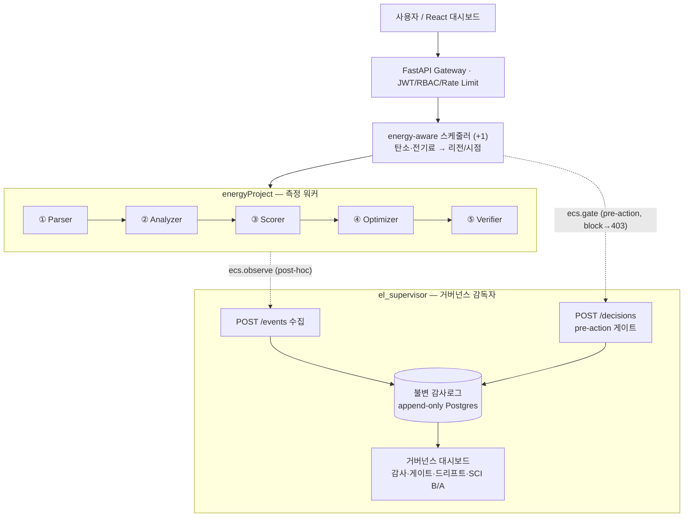
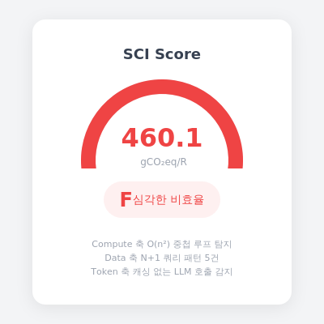
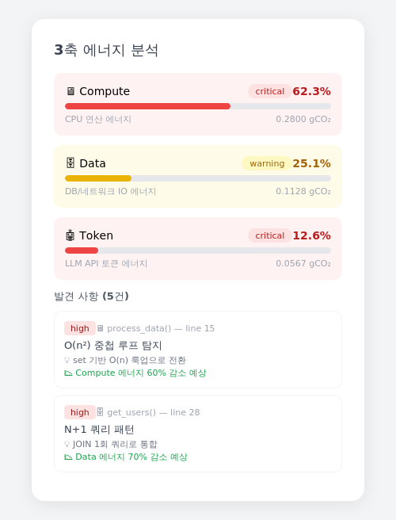
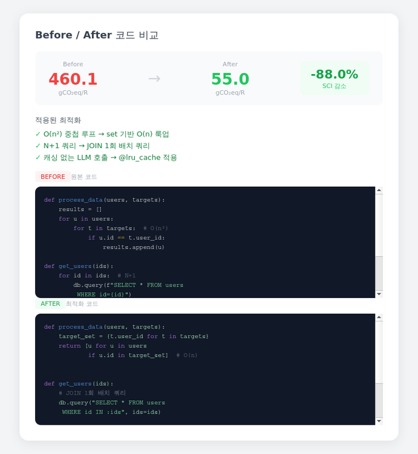

# energyProject

**ISO/IEC 21031:2024 SCI 기반 코드 에너지 분석 + AI 자동 최적화 플랫폼**

> 코드를 넣으면 국제 표준(SCI) 기반 탄소 강도 점수가 나오고, AI가 최적화 코드를 산출합니다.

---

## 한 줄 요약 — 측정 × 거버넌스 × energy-aware

코드/에이전트의 **탄소·전력을 측정**(SCI, ISO/IEC 21031)하고, 그 에이전트 행동을
**감사·게이트**(EU AI Act / 한국 AI 기본법 — 불변 감사로그 + 결정론적 pre-action 게이트)하며,
전력병목 시대의 **energy-aware 배치 결정**(가용 리전 중 최저 탄소·전기료 선택)을 증명한다.

- **측정** — `energyProject`: 5단계 파이프라인이 코드의 SCI(Before/After)를 산출.
- **거버넌스** — [`el_supervisor`](../el_supervisor): 모든 단계가 불변 감사로그(append-only)에
  기록되고, pre-action 게이트가 위험 행동을 실행 전 차단(HTTP 403). "감독자 × N 워커"
  상호증명(Direction C).
- **energy-aware** — 스케줄러 에이전트(+1)가 탄소·전기료 신호로 최저 리전을 고르거나 지연을 권고.

## 시스템 한눈에 (Direction C)



---

## 핵심 가치

| Before | After | 감소 |
|--------|-------|------|
| SCI 460.1 (F등급) | SCI 55.0 (D등급) | **88% 탄소 배출 감소** |

```
입력: 캐싱 없는 LLM 호출 + O(n²) 중첩 루프 + N+1 쿼리
출력: @lru_cache 추가 + set 기반 O(n) + JOIN 1회 쿼리
검증: Before/After를 동일 파이프라인으로 재분석하여 실측
```

## 스크린샷

| SCI 점수 게이지 | 3축 에너지 분석 | Before/After 비교 |
|:---:|:---:|:---:|
|  |  |  |

## 왜 만들었는가

ICT 산업은 전 세계 온실가스 배출의 2.1~3.9%를 차지하며, 2040년까지 14%로 증가할 전망입니다.
Green Software Foundation은 이에 대응하여 **SCI(Software Carbon Intensity)** 점수 체계를 만들었고,
2024년 **ISO/IEC 21031:2024** 국제 표준으로 제정되었습니다.

그러나 SCI를 코드 레벨에서 자동 측정하고 최적화까지 해주는 도구는 없습니다.

| 기존 도구 | 하는 것 | 못하는 것 |
|-----------|---------|-----------|
| CodeCarbon | 런타임 전력 측정 | 코드 분석, 최적화 제안 |
| SonarQube | 코드 스멜 탐지 | 에너지/탄소 측정 |
| **energyProject** | **코드 정적 분석 + SCI 점수 + AI 최적화 + Before/After 검증** | |

## SCI 공식 — ISO/IEC 21031:2024

```
SCI = ((E x I) + M) / R

E = 에너지 소비량 (kWh)     — 3축 분석: Compute + Data + Token
I = 탄소 강도 (gCO2/kWh)    — 지역별 (한국 450, 프랑스 60, 노르웨이 20)
M = 내재 탄소 (gCO2)        — 하드웨어 제조 시 배출된 탄소 할당분
R = 기능 단위               — API 호출 1건 기준
```

## 아키텍처

```
[사용자] → React 대시보드
              ↓
         FastAPI Gateway (JWT + RBAC + Rate Limiting)
              ↓
         Kafka (비동기 메시징)
              ↓
    ┌─────────────────────────────────┐
    │  분석 파이프라인 (5단계)          │
    │  ① Parser    → AST 파싱         │
    │  ② Analyzer  → 3축 에너지 추정   │
    │  ③ Scorer    → SCI 점수 + 근거   │
    │  ④ Optimizer → Claude API 최적화 │
    │  ⑤ Verifier  → Before/After 검증 │
    └─────────────────────────────────┘
              ↓
    PostgreSQL (이력) + Redis (캐시)
              ↓
    K8s EKS + Helm + ArgoCD (GitOps 배포)
```

## 기술 스택

| 레이어 | 기술 | 근거 |
|--------|------|------|
| Frontend | React 18 + Vite + Tailwind + Recharts | SCI 게이지, 3축 차트, Before/After diff |
| State | Zustand + React Query | 클라이언트/서버 상태 분리 |
| API | FastAPI + OpenAPI | Python AST 생태계 활용 + 자동 Swagger |
| Auth | JWT + RBAC + RTR + Rate Limiting | free 5회/pro 1000회/admin 무제한 |
| Pipeline | 5단계 파이프라인 아키텍처 | Parser → Analyzer → Scorer → Optimizer → Verifier |
| Messaging | Kafka | 비동기 처리 + 재시도 보장 |
| AI | Claude API (Mock + Real) | 최적화 코드 생성 + Protocol 패턴 |
| Infra | K8s(EKS) + Helm + ArgoCD | HPA 오토스케일링 + GitOps |
| CI/CD | GitHub Actions | pytest + SCI 관문 + Docker build |
| Governance | el_supervisor (별도 레포) | 불변 감사로그 + pre-action 게이트 (EU AI Act / 한국 AI 기본법) |
| Scheduler | energy-aware 스케줄러 (+1) | 탄소·전기료 최저 리전 선택 / 지연 권고 (PEP·PDP 분리) |
| Test | pytest 210 tests | SCI 공식, 파이프라인, 스케줄러, 게이트 배선, API, Kafka, E2E, Pearson r |

## 프로젝트 구조

```
backend/
├── main.py                    # FastAPI 진입점 + 7개 엔드포인트
├── config.py                  # SOURCE="SCI_ISO21031" + 환경설정
├── auth/                      # JWT + RBAC + Rate Limiting
├── pipeline/                  # 5단계 분석 파이프라인
│   ├── parser.py              # ① AST 파싱 + 패턴 추출
│   ├── analyzer.py            # ② 3축 에너지 추정
│   ├── scorer.py              # ③ SCI 점수 + 등급 + 근거
│   ├── optimizer.py           # ④ Claude API 최적화 코드 생성
│   ├── verifier.py            # ⑤ Before/After SCI 비교 검증
│   └── scheduler.py           # (+1) energy-aware 배치 리전 결정 — 앞단 결정자
├── ecs_integration.py         # el_supervisor 배선 (best-effort observe/gate)
├── sci/                       # SCI 계산 엔진
│   ├── formula.py             # SCI = ((E x I) + M) / R
│   ├── energy_model.py        # 3축 에너지 추정 모델
│   ├── carbon_intensity.py    # 17개 국가 + 17개 클라우드 리전
│   └── embodied_carbon.py     # 12개 인스턴스 타입별 내재 탄소
├── events/                    # Kafka 비동기 처리
└── tests/                     # 210 테스트 (test_scheduler · test_ecs_wire 포함)

frontend/
├── src/components/
│   ├── ScoreGauge.jsx         # SCI 점수 게이지
│   ├── AxisBreakdown.jsx      # 3축 상세 분석
│   ├── CodeDiff.jsx           # Before/After 코드 비교
│   └── TrendChart.jsx         # 분석 이력 트렌드

infra/
├── docker-compose.yml         # PostgreSQL + Redis + Kafka + API
├── k8s/helm/greenpulse/       # Helm Chart (7 templates)
│   ├── templates/hpa.yaml     # HPA 워커 오토스케일링 (2→10 Pod)
│   ├── values-dev.yaml        # 개발 환경
│   └── values-prod.yaml       # 프로덕션 환경
└── argocd/application.yaml    # ArgoCD GitOps 배포
```

## 실행 방법

```bash
# 1. 인프라 기동 (PostgreSQL + Redis + Kafka)
docker compose -f infra/docker-compose.yml up -d

# 2. 백엔드 테스트
docker exec gp-api pytest tests/ -v

# 3. 프론트엔드 개발 서버
cd frontend && npm install && npm run dev

# 4. 브라우저에서 http://localhost:5173
# 데모 계정: admin / greenpulse
```

## 테스트

```bash
# 전체 테스트 실행
python -m pytest backend/tests/ -v

# 핵심 검증
# - SCI 공식: E=1.0, I=450, M=10, R=1000 → SCI=0.46
# - Pearson r > 0.7 (정적 분석 정확도 가설)
# - Before/After SCI 감소율 > 50%
# - Rate Limiting: free 유저 6번째 요청 → 429
# - RTR: 사용된 refresh token 재사용 → 401
```

## 검증된 결과물

```
sample_bad.py  → SCI 460.1 (F) | 이슈 5건 | O(n²) + N+1 + 캐싱없는 LLM
sample_good.py → SCI  55.0 (D) | 이슈 2건 | O(n) + JOIN + @lru_cache
sample_mixed   → SCI  10.0 (B) | 이슈 1건 | N+1만 존재

최적화 적용: Before 460(F) → After 55(D) = 88% SCI 감소 실증
```

---

*ISO/IEC 21031:2024 | Green Software Foundation SCI*
*K8s EKS + Helm + ArgoCD | GitHub Actions CI/CD*
